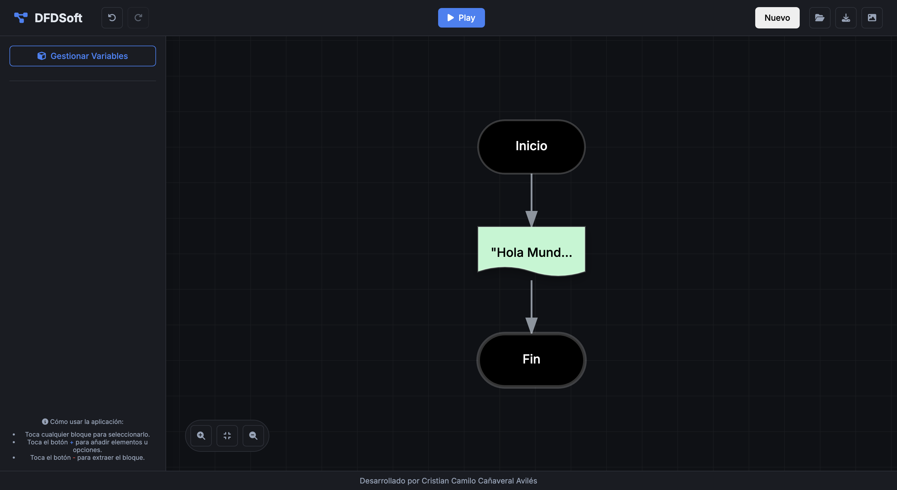

# DFDSoft 🚀

**DFDSoft** es una aplicación web progresiva (PWA) diseñada para la creación, edición y simulación interactiva de Diagramas de Flujo de Datos (DFD). Orientada a estudiantes y profesionales, permite construir algoritmos visuales de manera intuitiva y verificar su lógica en tiempo real.

 <!-- TODO: Agrega una captura de tu app aquí -->

## 🌟 Características Principales

- **Interfaz de Grafo Interactivo:** Construye diagramas con simples clics. Selecciona un bloque y utiliza los botones contextuales (`+` / `-`) para ramificar u organizar tu flujo (¡Cero arrastrar y soltar complicado!).
- **Simulador Integrado:** Ejecuta tus algoritmos paso a paso o en flujo continuo, interactuando con modales emergentes para el ingreso (Entrada) y visualización (Salida) de datos.
- **Gestión de Variables:** Declara y manipula variables globales durante la simulación con el visor de estado en tiempo real.
- **Bloques Soportados:**
  - `Inicio / Fin`
  - `Salida de Datos` (Impresión en pantalla)
  - `Entrada de Datos` (Lectura por teclado)
  - `Acción (Operación)` (Asignación y matemática matemática)
  - `Condicional (Sí/No)`
  - `Ciclo Mientras Que (MQ)`
- **Exportación e Importación:** Guarda tus proyectos en el formato ligero `.dfd` o impórtalos para continuar trabajando más tarde.
- **Exportación Gráfica Profesional:** Exporta todo tu diagrama directamente a `.png`. El sistema ajusta matemáticamente el cuadro delimitador (*Bounding Box*) para garantizar que tu trabajo se exporte completo, sin importar la escala de zoom.
- **100% Offline (PWA):** Instálala en tu escritorio o dispositivo móvil para usarla sin conexión a internet.

## 🛠 Instalación y Uso

### Como Aplicación Web Progresiva (PWA)
1. Ingresa a la página oficial alojada (Ej: *GitHub Pages*).
2. Haz clic en el ícono de instalación en la barra de direcciones de tu navegador (Chrome, Edge) o en el menú "Añadir a la pantalla de inicio" en dispositivos móviles.
3. ¡Úsala como una aplicación nativa!

### Ejecución Local para Desarrollo
Si deseas correr el proyecto en tu máquina para modificarlo:
1. Clona este repositorio:
   ```bash
   git clone https://github.com/TU_USUARIO/DFDSoft.git
   ```
2. Inicia un servidor HTTP local en la raíz del proyecto. Por ejemplo, con Python:
   ```bash
   python -m http.server 8080
   ```
3. Entra a `http://localhost:8080` desde tu navegador.

## 💻 Tecnologías Utilizadas

- **HTML5 & CSS3:** Maquetación moderna, diseño "Glassmorphism", animaciones suaves y total responsividad.
- **Vanilla JavaScript (ES6+):** Lógica principal, motor matemático para diagramación de rutas SVG y simulador iterativo. Sin dependencias pesadas.
- **SVG (Scalable Vector Graphics):** Renderizado de nodos y conexiones en alta precisión infinita.
- **Service Workers:** Capacidades de caché y soporte Offline absoluto.
- **FontAwesome:** Sistema de íconos vectoriales.

## 🤝 Contribuir

¡Las contribuciones son bienvenidas! 
1. Haz un Fork del proyecto
2. Crea tu rama de características (`git checkout -b feature/NuevaCaracteristica`)
3. Haz Commit a tus cambios (`git commit -m 'Agrega NuevaCaracteristica'`)
4. Haz Push a la rama (`git push origin feature/NuevaCaracteristica`)
5. Abre un Pull Request

## 📄 Licencia

Este proyecto es desarrollado por **Cristian Camilo Cañaveral Avilés**. Distribuido bajo la Licencia MIT. (Sujeto a modificación según consideres).
